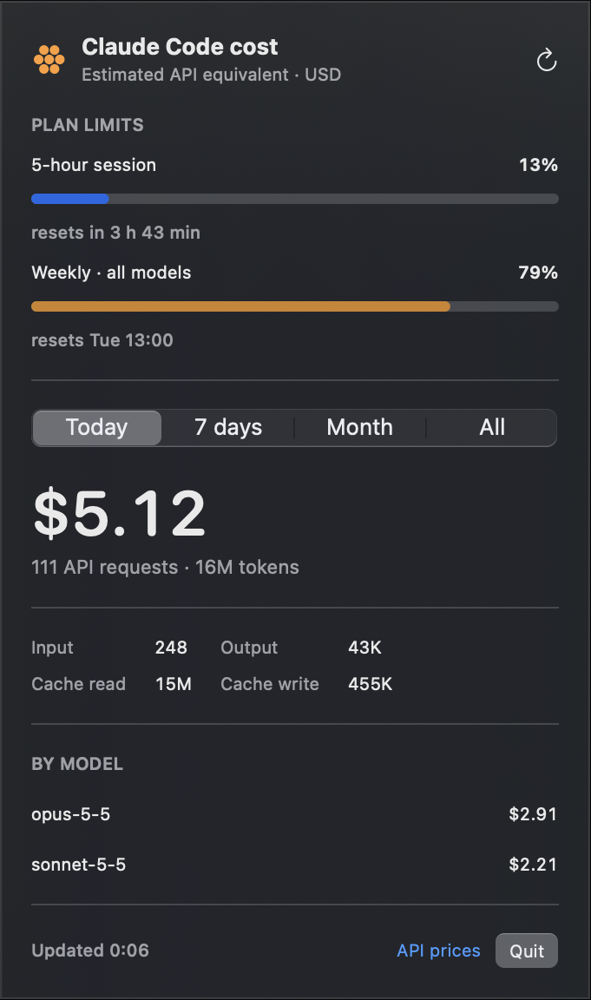

# Claude Cost Bar

A local macOS menu bar app showing what your Claude Code usage would cost at standard Claude API rates. It reads token counters from `~/.claude/projects/**/*.jsonl`; it does not need an API key or send your logs anywhere.

<p align="center"></p>

## Build and run

Requires macOS 14+ and Xcode command line tools.

```sh
./scripts/build-app.sh
open "dist/Claude Cost Bar.app"
```

The menu bar shows today's USD estimate. Click it to see your 5-hour and weekly plan limits and to switch between today, the last seven calendar days, this calendar month, and all time. The app refreshes every minute and whenever you open it. After the first scan it only parses log lines appended since the previous refresh, so idle CPU use is negligible.

This is an **estimate**, not your subscription bill. Rates are embedded as of 2026-09-24; use the “API prices” link to compare with current prices. Cache reads and five-minute/one-hour cache writes have their own rates. Repeated streaming log rows are counted once by request ID. Unknown model IDs are excluded and flagged. API extras such as server tools, regional multipliers, and taxes are not included.

## Plan limits

The 5-hour and weekly percentages come from the same endpoint Claude Code's `/usage` command uses (`api.anthropic.com/api/oauth/usage`). The app reuses the OAuth token Claude Code stores in the macOS Keychain (`Claude Code-credentials`, read via `/usr/bin/security`; fallback `~/.claude/.credentials.json`). It never refreshes the token itself — if it has expired, run `claude` once. Limits are fetched only when you open the panel (at most once a minute) or press refresh. This endpoint is undocumented and may change.

## How it compares to OpenUsage

[OpenUsage](https://www.openusage.ai) is a great, actively maintained menu bar app covering many AI providers. If you use Codex, Cursor, Copilot and others alongside Claude, it is probably the better choice. Claude Cost Bar is deliberately narrower:

- **Minimal access.** It reads only Claude Code's local session logs and the single Keychain item Claude Code already created. It does not read browser cookies, other providers' credentials, or sync anything to iCloud.
- **Small and auditable.** About 700 lines of Swift with no dependencies — you can read the whole thing before running it.
- **Detailed API-equivalent cost.** Per-model pricing, separate rates for cache reads and five-minute/one-hour cache writes, fast mode, and request-level de-duplication of streamed log rows.
- **Runs on macOS 14+** (OpenUsage requires macOS 15+, per its website).
- **Light on resources.** Logs are parsed incrementally; after the first scan a refresh costs a fraction of a second of CPU per minute.

## Disclaimer

Unofficial community tool, not affiliated with or endorsed by Anthropic. "Claude" is a trademark of Anthropic, PBC.

## License

[MIT](LICENSE)
